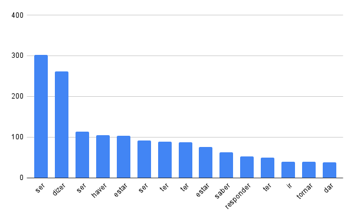
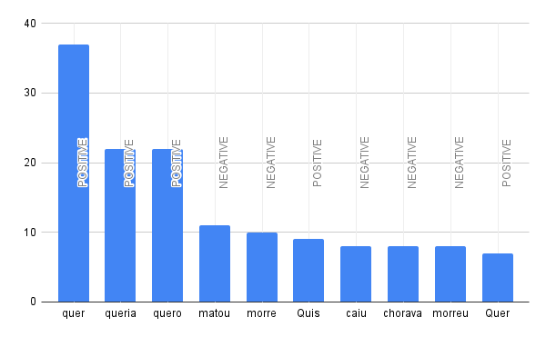

<h1>Análise de Sentimentos em Verbos - Amor de Perdição (Camilo Castelo Branco)</h1>

Utilizando o comando <i>tagger</i> da ferramenta <b>linguakit</b> - no terminal - para analisar as entidades presentes no arquivo <i>"Camilo-Amor_de_Perdicao.txt"</i>, criei um documento de extenção .tag - <i>"enty_amor_de_perdicao.tag"</i> - para receber o output deste comando e armazenar os seus resultados.


```python
linguakit tagger pt -nec Camilo-Amor_de_Perdicao.txt > enty_amor_de_perdicao.tag
```

Em seguida - ainda no terminal - utilizei uma soma dos comandos <i>"grep"</i> and <i>"sort"</i> para procurar (grep) por todas as entidades do tipo VMI - verbo - em <i>"enty_amor_de_perdicao.tag"</i>, ordená-las (sort) pela sua quantidade de ocorrências e gravar esses resultados em um arquivo de extensão .csv - <i>"verb_amor_de_perdicao.csv"</i> -


```python
grep VMI enty_amor_de_perdicao.tag | sort | uniq -c | sort -n > verb_amor_de_perdicao.csv
```

Após isso, fiz o upload do arquivo <i>"verb_amor_de_perdicao.csv"</i> no Google Sheets, ordenei a lista de ocorrências em ordem decrescente e assim fiz um gráfico de barras para vizualizar os 15 verbos que mais aparecem no livro <i>"Camilo-Amor_de_Perdicao.txt"</i>



Em seguida, utilizei o comando <i>sent</i> - também da ferramenta <b>linguakit</b> - para analisar o sentimento dos verbos listados em <i>"verb_amor_de_perdicao.csv"</i> e salvar o output em outro arquivo de extensão .csv <i>"verb_sent_perdicao.csv"</i>


```python
linguakit sent pt verb_amor_de_perdicao.csv > verb_sent_perdicao.csv
```

Por fim, fiz a limpeza dos dados em <i>"verb_sent_perdicao.csv"</i> criando um filtro para vizualizar somente os verbos que tivessem um sentimento positivo ou negativo atribuído a eles, e os ordenei em seguida por ordem descescente. Assim, podemos vizualizar - entre os verbos que mais ocorrem no livro - aqueles que tem algum sentimento agregado ao mesmo, e qual sentimento é esse.


